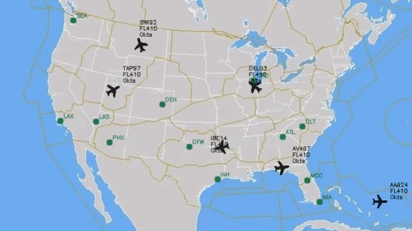

# CPPND: Capstone Project - EnRoute

This is the project for the C++ Capstone Project course in the [Udacity C++ Nanodegree Program](https://www.udacity.com/course/c-plus-plus-nanodegree--nd213): Capstone Project. 

EnRoute Air Traffic Controller

Based on the Q-Learning algorithm and more specifically on the Bellman Equations a prototype of multithreading net of self-deiciding aircrafts choose the best option to continue its path... 

## Dependencies for Running Locally
* cmake >= 2.8
  * All OSes: [click here for installation instructions](https://cmake.org/install/)
* make >= 4.1 (Linux, Mac), 3.81 (Windows)
  * Linux: make is installed by default on most Linux distros
  * Mac: [install Xcode command line tools to get make](https://developer.apple.com/xcode/features/)
  * Windows: [Click here for installation instructions](http://gnuwin32.sourceforge.net/packages/make.htm)
* OpenCV >= 4.1
  * The OpenCV 4.1.0 source code can be found [here](https://github.com/opencv/opencv/tree/4.1.0)
* gcc/g++ >= 5.4
  * Linux: gcc / g++ is installed by default on most Linux distros
  * Mac: same deal as make - [install Xcode command line tools](https://developer.apple.com/xcode/features/)
  * Windows: recommend using [MinGW](http://www.mingw.org/)

## Basic Build Instructions

1. Clone this repo.
2. Make a build directory in the top level directory: `mkdir build && cd build`
3. Compile: `cmake .. && make`
4. Run it: `./enroute`.

## Project Description

When the project is built a 'schedule list' of flights can be seen at './data/us_acfts.dat' and a list of available airports at './data/us_airports.dat'. This files set up airports and aircrafts as 'TrafficObject' classes and proper attributes are assigned.

Based on an image which is properly read a squared grid is set in equivalence to every position in the image where traffic objects live in.

The aim of the project was to set a Q-learning algorithm that based on a negative reward with respect to proper aircraft destination that generates more appealing (higher rewarded) states the closer we are to the destination (from cero at destination growing as l1 euclidean distance for every cell in the grid).

At the same time negative rewards are set for every aircraft thread when choosing to move on close to other aircrafts trajectories.

The algorithm, based on Bellman equations, is set up but somehow the decission matrix is full of zeros in many or most of the grid making the decision to chose whether to go straight or turning right or left 10 dg unavailable.

At the end, aircrafts not deviated by the '_ql_pi_star' matrix to chose a different action than going straight forward follow their initial path set by origin and rwy at origin.

Nonetheless, the project meets specifications regarding de C++ Nanodegree in all the relevant features learned in the courses and therefore it is handle for revision:

(We are very close to the next due payment and meeting specifications and functionalities above MachineLearning topics seem to be enough to pass the Nanodegree and move forward hopefully for other Nanodegrees in the AI arena...)

- **RP.1** : README with instructions is included where it is indicated the project description of my choice and Rubric Points (RP) addressed.
- **RS.2** : The submission compile and run.
- **RS.3** : The project makes use of C++ functions, control structures, reads data when needed and process user inputs made by the '*.dat' files provided; changing threads, destinations, etc. easily...
- **RS.4** : Object Oriented programming is used at its best to fit the program objectives using constructors, techniques, initzialization, encapsulating, inheriting behaviour, casting dinamically, etc.
- **RS.5** : The project make use of smart pointers and properly addreses memory on the heap, stack, etc. as it is stated in the valgrind reporting file. 
- **RS.6** : The project uses multithreading, mutexes, locks, condition variables and futures.